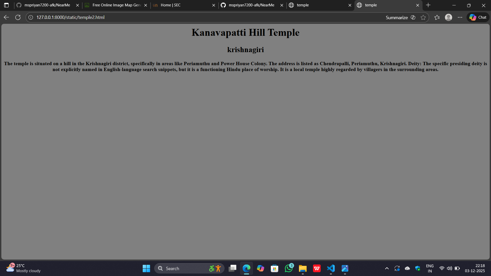
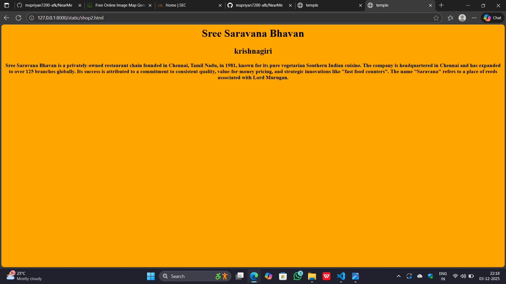

# Ex03 Places Around Me
## Date: 03-12-2025

## AIM
To develop a website to display details about the places around my house.

## DESIGN STEPS

### STEP 1
Create a Django admin interface.

### STEP 2
Download your city map from Google as an image.

### STEP 3
Insert the image using `````` tag and link it to the map.

### STEP 4
Using ```<map>``` tag name the map.

### STEP 5
Create clickable regions in the image using ```<area>``` tag.

### STEP 6
Write HTML programs for all the regions identified.

### STEP 7
Execute the programs and publish them.

## CODE
```
<html>
    <head>
        <title>MAP</title>
    </head>
    <body>
        <h2 align="center">KRISHNAGIRI</h2>
        <h3 align="center">25017302 PRIYAN</h3>
        

<map name="image-map">
    <area target="" alt="dam park" title="dam park" href="dam.html" coords="3,724,72,708,174,725,177,780,2,772" shape="poly">
    <area target="" alt="temple1" title="temple1" href="temple1.html" coords="766,649,79" shape="circle">
    <area target="" alt="temple2" title="temple2" href="temple2.html" coords="1035,2,1120,0,1264,9,1264,34,1164,61,1066,36" shape="poly">
    <area target="" alt="shop1" title="shop1" href="shop1.html" coords="134,46,351,103" shape="rect">
    <area target="" alt="shop2" title="shop2" href="shop2.html" coords="220,629,434,658" shape="rect">
</map>
    </body>
</html>


<html>
    <head>
        <title>KRP dam</title>
    </head>
    <body bgcolor="pink" align="center">
        <h1 align="center">KRP dam</h1>
        <h2 align="center">krishnagiri</h2>
        The Krishnagiri Reservoir Project (KRP) Dam is a major irrigation dam in Tamil Nadu's Krishnagiri district, built between 1955 and 1957 across the Thenpennai River. Its key facts include providing irrigation for thousands of acres, a gross storage capacity of \(47.156\) MCM (million cubic meters), and being a popular tourist spot with a park that features gardens, fountains, and a children's play area. The dam was inaugurated by former Chief Minister K. Kamaraj. 
    </body>
</html>


<html>
    <head>
        <title>temple</title>
    </head>
    <body bgcolor="cyan" align="center">
        <h1 align="center">Sri Bhairava Nilayam</h1>
        <h2 align="center">krishnagiri</h2>
        <h4>Sri Bhairava Nilayam is a non-profit spiritual and humanitarian organization in Krishnagiri District, Tamil Nadu, founded in 2013 by the spiritual guru Thavathiru Bhairava Swamigal. It functions as a temple and ashram dedicated to the worship of Lord Bhairava, a fierce, protective manifestation of Lord Shiva. </h4>
    </body>
</html>


<html>
    <head>
        <title>temple</title>
    </head>
    <body bgcolor="grey" align="center">
        <h1 color="red" align="center">Kanavapatti Hill  Temple</h1>
        <h2 color="red" align="center">krishnagiri</h2>
        <h4> The temple is situated on a hill in the Krishnagiri district, specifically in areas like Periamuthu and Power House Colony. The address is listed as Chendrapalli, Periamuthu, Krishnagiri.
Deity: The specific presiding deity is not explicitly named in English-language search snippets, but it is a functioning Hindu place of worship. It is a local temple highly regarded by villagers in the surrounding areas.</h4>
    </body>
</html>


<html>
    <head>
        <title>shop</title>
    </head>
    <body bgcolor="yellow" align="center">
        <h1 align="center">Murugan Idli Shop</h1>
        <h2 align="center">krishnagiri</h2>
        <h4>Murugan Idli Shop is a popular chain of vegetarian restaurants in Tamil Nadu, known for its South Indian cuisine like idli, dosa, and jigirthanda. Its origin is a family story from Madurai, where the owner's mother began making idlis to supplement the income of their original coffee shop, leading to the establishment of the now-famous restaurant. The shop is known for its authenticity and has multiple branches in Chennai and even in Singapore. </h4>
        </body>
</html>


<html>
    <head>
        <title>shop</title>
    </head>
    <body bgcolor="orange" align="center">
        <h1 align="center">Sree Saravana Bhavan</h1>
        <h2 align="center">krishnagiri</h2>
        <h4>Sree Saravana Bhavan is a privately-owned restaurant chain founded in Chennai, Tamil Nadu, in 1981, known for its pure vegetarian Southern Indian cuisine. The company is headquartered in Chennai and has expanded to over 125 branches globally. Its success is attributed to a commitment to consistent quality, value-for-money pricing, and strategic innovations like "fast food counters". The name "Saravana" refers to a place of reeds associated with Lord Murugan. </h4>
    </body>
</html>


```

## OUTPUT


 
 
 



## RESULT
The program for implementing image maps using HTML is executed successfully.
